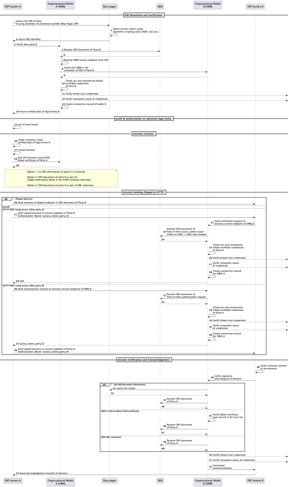

# Business eInvoicing with Decentralized Identifiers - Process Flow

## Overview

This document describes a real-world use case for the Blue Pages application, demonstrating how decentralized identifiers (DIDs) and verifiable credentials can streamline and secure the business-to-business eInvoicing process. The scenario follows a transaction between two companies, from initial order placement to invoice acceptance, using decentralized identity verification at each step.

## Scenario Description

In this scenario, a customer ("Pierre") from Fabaleus BV purchases custom-printed products from VistaPrint. The process illustrates how DIDs and the Blue Pages registry facilitate secure, efficient business transactions with automatic identity verification and electronic invoice handling.

## Process Flow Diagram

## Detailed Process Flow

### 1. Initial Order and Company Identification

1. **Customer Places Order**: Pierre visits VistaPrint's website and orders 20 custom-printed water bottles (doppers) with Fabaleus BV's logo.

2. **Business Identification**: During the checkout process, Pierre provides Fabaleus BV's Chamber of Commerce (CoC) number to identify the business entity that will receive the invoice.

3. **DID Resolution via Blue Pages**: VistaPrint uses the Blue Pages registry (FIDES) to search for Fabaleus BV's decentralized identifier (DID) using the provided CoC number.
    - Blue Pages searches its registry and selects the correct match using identifiers (trading name, RSIN, CoC number, etc.)
    - Blue Pages returns the DID identifier of Fabaleus BV to VistaPrint's ERP system

### 2. Customer Identity Verification

4. **Verification Request**: VistaPrint's ERP system asks its Organizational Wallet (OWA) to verify Fabaleus BV's identity data.

5. **DID Document Retrieval**: VistaPrint's Organizational Wallet resolves Fabaleus BV's DID document through EBSI (European Blockchain Service Infrastructure).
    - The DID document contains cryptographic proof of identity, service endpoints, and credential information

6. **Endpoint Resolution**: VistaPrint's wallet extracts the service endpoint information from Fabaleus BV's DID document.

7. **DID Control Verification**: VistaPrint's wallet communicates with Fabaleus BV's Organizational Wallet (OWB) to verify that it controls the claimed DID.
    - This prevents spoofing and ensures the DID is active and valid

8. **Credential Verification**: VistaPrint's wallet verifies Fabaleus BV's business credentials:
    - LPID (business registry credential)
    - VAT number credential
    - Additional linked verifiable presentations

9. **Trust Framework Verification**: The wallet verifies the linked trust credentials against established trust frameworks.

10. **Revocation Check**: The wallet checks that none of the credentials have been revoked.

11. **Connection Establishment**: VistaPrint's wallet creates a secure connection record with Fabaleus BV's wallet for future communications.

12. **Verification Completion**: The verified business data of Fabaleus BV is returned to VistaPrint's ERP system. Fabaleus BV is accepted as a customer

13. **Customer Creation**: VistaPrint's ERP system creates a customer record using the verified data of Fabaleus BV.

### 3. produce and deliver goods

**out of scope**

### 4. eInvoice Creation and Authorization

14. **Invoice Generation**: VistaPrint's ERP system generates an electronic invoice for the order.

15. **Document Sealing**: VistaPrint's ERP system requests its Organizational Wallet to seal the eInvoice using the company's X509 Qualified Electronic Seal (QSeal) certificate.
    - The sealed invoice contains cryptographic proof of its authenticity and integrity
    - The DID information may be included via one of several mechanisms:
        - Option 1: No DID information included (relies on Blue Pages lookup)
        - Option 2: DID document included in the Subject Alternative Name field of the X509 certificate
        - Option 3: DID document included as part of a UBL extension in the invoice

### 5. eInvoice Transmission

16. **Invoice Delivery**: VistaPrint's ERP system sends the signed eInvoice to Fabaleus BV's ERP system using one of the following methods:
    - Through the Peppol network using the endpoint specified in Fabaleus BV's DID document
    - Via direct HTTP POST to Fabaleus BV's service endpoint with appropriate authorization token
    - The selected method in this scenario is HTTP POST with access_token_party_A

17. **Authorization**: When using HTTP POST:
    - VistaPrint includes an access token (access_token_party_A) in the Authorization header
    - This token proves VistaPrint's identity and authorization to submit the invoice

### 6. eInvoice Verification and Acceptance

18. **Verification Request**: Fabaleus BV's ERP system forwards the eInvoice to its Organizational Wallet for verification.

19. **Sender Identity Resolution**: Fabaleus BV's wallet resolves VistaPrint's DID document from the access token issuer information.
    - If no DID information was included in the invoice, it may search Blue Pages to find the match
    - If DID was included in the certificate or UBL extension, it can directly resolve the document
    - If an access_token was send, it's possible to use DNS + /did/.well-known to resolve the DID document 

20. **Credential Verification**: Fabaleus BV's wallet verifies VistaPrint's business credentials, including:
    - Business registry credentials
    - VAT number credentials
    - Additional linked verifiable presentations

21. **Trust Framework Verification**: The wallet verifies VistaPrint's linked trust credentials.

22. **Revocation Check**: The wallet checks that none of VistaPrint's credentials have been revoked.

23. **Connection Establishment**: Fabaleus BV's wallet creates a connection record for VistaPrint's wallet.

24. **Acknowledgment**: Fabaleus BV's wallet sends an acknowledgment (ACK) to VistaPrint.

25. **Semantic Verification**: Fabaleus BV's ERP system verifies the semantic content of the invoice.

26. **Signature Verification**: Fabaleus BV's wallet verifies the signature and integrity of the eInvoice.

27. **Receipt Timestamp**: Fabaleus BV's wallet timestamps the received eInvoice and provides this timestamp to the ERP system.

28. **Final Acknowledgment**: Fabaleus BV's ERP system sends a final receipt acknowledgment to VistaPrint's ERP system.

29. **Invoice Acceptance**: Fabaleus BV accepts the eInvoice, completing the transaction.

## 7. pay invoice

**out of scope**

## Benefits of This Approach

- **Automated Identity Verification**: Eliminates manual verification of business credentials.
- **Enhanced Security**: Cryptographic proofs ensure the authenticity of all parties and documents.
- **Streamlined Process**: Service endpoints in DID documents enable direct system-to-system communication.
- **Interoperability**: Works across different ERP systems and electronic invoice formats.
- **Regulatory Compliance**: Supports requirements for electronic invoicing and business identification.
- **Reduced Fraud**: Cryptographic verification prevents identity spoofing and document tampering.
- **Audit Trail**: All steps create verifiable records for future reference or audit purposes.

## Technical Requirements

To implement this scenario, businesses need:

1. **ERP Integration**: ERP systems capable of resolving DIDs and processing eInvoices
2. **Organizational Wallet**: A DID-compatible wallet for managing business identities and credentials
3. **Blue Pages Registration**: Business identity registered in the Blue Pages (FIDES) registry
4. **DID Document**: Published DID document with appropriate service endpoints
5. **Verifiable Credentials**: Business credentials from authorized issuers
6. **X509 Certificate**: Qualified Electronic Seal certificate for document signing

## Conclusion

This use case demonstrates how the Blue Pages application, combined with decentralized identity technologies, can transform business-to-business transactions by providing a secure, efficient framework for company verification and eInvoice processing. By leveraging DIDs and verifiable credentials, businesses can reduce administrative overhead, enhance security, and streamline their procurement and billing processes.